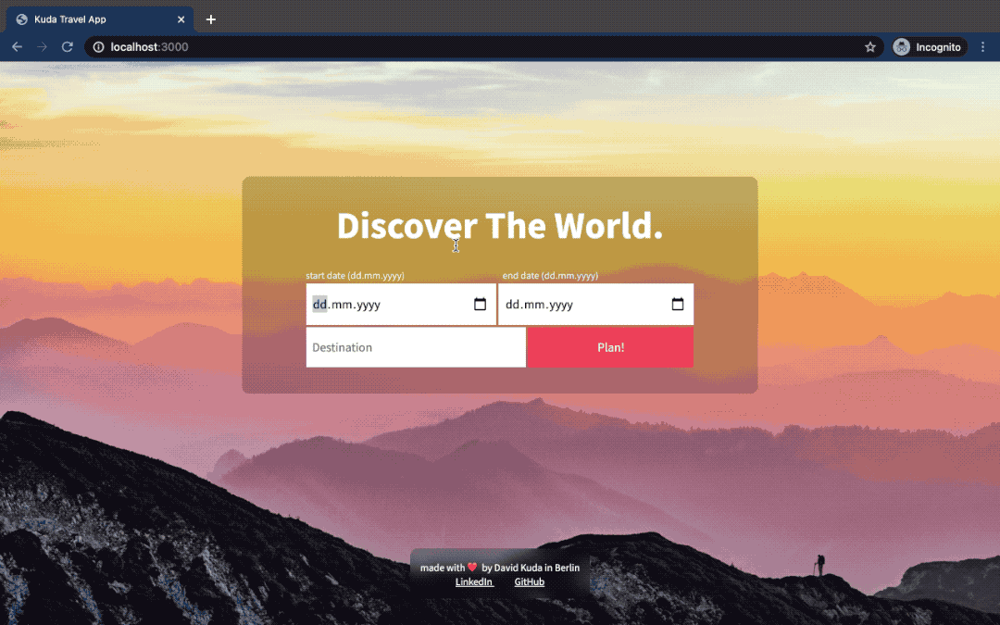

# travel-app

In this repo I have built my capstone project of [Udacity's](https://www.udacity.com/course/front-end-web-developer-nanodegree--nd0011) Front End Engineer Degree.

The user enters a destination and a date for departure and arrival. Based on that, the app requests information on three APIs; it gets geo-location data from Geonames API, Weatherdata from Weatherbit API and a picture of the city from Pixabay API. The app shows duration and end date of trip. Plus the app gets the weather of the next three days of that location.

### Running the App

- `npm run build-dev` will run the app in dev mode on port 8081
- `npm run build-prod`will create a build into dist/ folder
- `npm run start`runs server.js on port 3000

### Tech Stack
- Node JS
- Webpack
- Vanilla JS
- SASS
- HTML5 & CSS3

### Core Topics
- Build process using Webpack
- Asynchronous JavaScript
- API Requests
- Single Page Apps (with vanilla JS)

## Overview of previous Udacity's "Front End Developer" Nanodegree Projects

Here is what I did in the previous Udacity Front End Web Developer Projects:

- __Project 1:__ Building two  pages of a responsive blog design, first page blog overview, second page a blog post. Using HTML5 and CSS3 to publish a website. Focus: Responsive design with CSS Grid, flexbox and Media Queries. [Link To Repository ...](https://github.com/DavidKuda/personal-music-blog)
- __Project 2:__ Using (Vanilla) JavaScript to make a website interactive and dynamic. With this project I could apply all my knowledge of JS and WebDev and deepen it immensively. I have built a website that detects sections of a page, highlights them, adds the detected sections to the navigation, adds a new section after clicking a button and more ... [Link To Repository ...](https://github.com/DavidKuda/vanilla-js-landingpage)
- __Project 3:__ Use asynchronous JavaScript (Async / Await) to fetch data from an API, in this case from www.openweathermap.org. It then chains multiple functions which are dependendent upon each other. [Link To Repository ...](https://github.com/DavidKuda/weather-journal-app)
- __Project 4:__ This project was extensive, I have used everything previously covered, especially asynchronous JS. I worked with __Webpack__ and thus created my functions as modules. The app ran on a development environment and a production environment. The server used __node.js__ as technology. I used __JEST__ for unit testing. [Link To Repository ...](https://github.com/DavidKuda/webpack-single-page-app)
